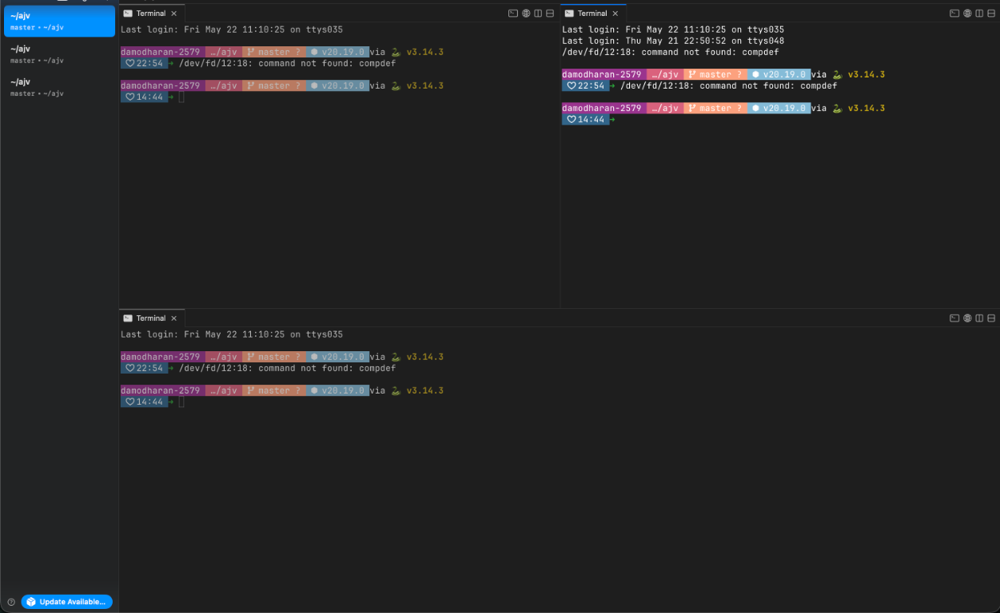

# Ghost-mux — Dashboard Builder

## Overview

Ghost-mux is a GPUI-based desktop **dashboard builder**. The app starts with a single full-screen panel. The user can split any panel horizontally or vertically to create arbitrary grid layouts. All splits are resizable via drag handles.

## Design Reference

- Theme, colors, and font reference image: `assets/design/reference-theme.png`
- Preview:



---

## Architecture

### Layout Tree (`PanelLayout`)

The entire UI is represented as a **binary tree** stored in `DashboardView`:

```
Leaf(id)                     — a single panel with content
HSplit { left, right, id }   — two panels side-by-side (resizable)
VSplit { top, bottom, id }   — two panels stacked (resizable)
```

Every node has a unique `usize` ID managed by `DashboardView::next_id`.

### State — `DashboardView`

| Field      | Type          | Purpose                              |
|------------|---------------|--------------------------------------|
| `layout`   | `PanelLayout` | Root of the layout tree              |
| `next_id`  | `usize`       | Monotonically increasing ID counter  |

Mutations:
- `split_panel(id, dir, cx)` — replace `Leaf(id)` with an `HSplit`/`VSplit`
- `close_panel(id, cx)` — remove `Leaf(id)`; sibling fills the space

Both call `cx.notify()` so GPUI re-renders.

### Rendering — `render_layout`

Recursively traverses the tree:
- `Leaf(id)` → `render_panel(id, cx)` — shows panel content + toolbar
- `HSplit` → `h_resizable(...)` with two `resizable_panel` children
- `VSplit` → `v_resizable(...)` with two `resizable_panel` children

Resizable split IDs are formed as `"h-{id}"` / `"v-{id}"` and must be unique across the whole tree (guaranteed because `next_id` is monotonic).

### Panel Toolbar

Each leaf panel shows a floating toolbar (top-right corner, absolute position) with:
- `⬜→` — split panel horizontally (side by side)
- `⬜↓` — split panel vertically (stacked)
- `✕` — close panel (hidden when only one panel remains)

Buttons dispatch mutations via `cx.listener(move |this, _, _, cx| { ... })`.

---

## Adding Panel Content

Extend `render_panel_content(id, cx)` to map panel IDs to specific widgets:

```rust
fn render_panel_content(id: usize, cx: &mut Context<DashboardView>) -> AnyElement {
    match id {
        0 => render_chart(cx),
        1 => render_table(cx),
        _ => render_placeholder(id, cx),
    }
}
```

For now all panels show a placeholder with their ID.

---

## Key Files

| File                        | Role                                                        |
|-----------------------------|-------------------------------------------------------------|
| `src/main.rs`               | App entry point — window setup, theme application          |
| `src/dashboard.rs`          | `DashboardView` state, split/close mutations                |
| `src/layout.rs`             | `PanelLayout` binary tree and render helpers                |
| `src/settings.rs`           | `AppSettings` / `ThemeSettings` — loaded from settings.yaml |
| `src/persist.rs`            | `DashboardPersistedState` — YAML serialization of layout, tabs, and panel sizes |
| `src/terminal/`             | Terminal panel integration                                  |
| `Cargo.toml`                | GPUI + gpui-component + anyhow + terminal dependencies      |
| `rust-toolchain.toml`       | Pins Rust nightly channel for the workspace                 |
| `settings.yaml`             | Runtime settings (theme fonts, sizes, radius)               |
| `dashboard_state.yaml`      | Auto-generated persistence of layout, tabs, and panel sizes |
| `patches/libghostty-vt-sys` | Vendored build of libghostty-vt-sys with Zig bootstrap      |
| `patches/gpui-component`    | Local fork of gpui-component — adds `ResizableState::new_with_ratios` for panel-size restore |
| `tools/linux/ensure-zig.sh` | Download/cache repo-local Zig (Linux + shared shell logic)   |
| `tools/macos/ensure-zig.sh` | macOS wrapper → tools/linux/ensure-zig.sh                   |
| `tools/windows/ensure-zig.ps1` | Download/cache repo-local Zig (Windows PowerShell)      |
| `tools/windows/ensure-zig.cmd` | Thin cmd wrapper → ensure-zig.ps1                        |
| `tools/linux/build-production.sh` | Release build + dependency bundle (Linux + shared shell logic) |
| `tools/macos/build-production.sh` | macOS wrapper → tools/linux/build-production.sh       |
| `tools/windows/build-production.ps1` | Release build + bundle (Windows PowerShell)       |
| `tools/windows/build-production.cmd` | Thin cmd wrapper → build-production.ps1            |
| `tools/linux/run-production.sh` | Launch bundled binary (Linux + shared shell logic)      |
| `tools/macos/run-production.sh` | macOS wrapper → tools/linux/run-production.sh          |
| `tools/windows/run-production.ps1` | Launch bundled binary (Windows PowerShell)          |
| `tools/windows/run-production.cmd` | Thin cmd wrapper → run-production.ps1               |
| `tools/linux/dev-run.sh`        | `cargo run` for development (Linux + shared shell logic) |
| `tools/macos/dev-run.sh`        | macOS wrapper → tools/linux/dev-run.sh               |
| `tools/windows/dev-run.ps1`     | `cargo run` for development (Windows PowerShell)        |
| `tools/windows/dev-run.cmd`     | Thin cmd wrapper → dev-run.ps1                          |
| `AGENTS.md`                 | This file                                                   |
| `.gitignore`                | Ignores `/target`, `/dist`, `/.tools`                       |

---

## Framework Notes

- **GPUI** (zed-industries/zed) — reactive UI framework
- **gpui-component** (longbridge/gpui-component) — resizable panels, theme tokens
- **Theme**: always use `cx.theme()` tokens (`theme.background`, `theme.secondary`, `theme.foreground`, `theme.muted_foreground`, `theme.border`, `theme.accent`, `theme.muted`). Never hardcode colors except intentional palette values like green `rgb(0x57c994)` and red `rgb(0xf47067)`.
- **`AnyElement`**: every helper returns `.into_any_element()` for composability
- **`cx.listener`**: use `cx.listener(move |this, _, _window, cx| { ... })` for event handlers in render — captures by move, `this` is `&mut DashboardView`
- **Build**: `cargo run` (or `~/.cargo/bin/cargo run` if cargo is not on PATH)
- **Zig toolchain**: pinned at **0.15.2**, cached repo-locally at `.tools/zig/toolchain/` (gitignored). Auto-bootstrapped by `tools/linux/ensure-zig.sh` (or `tools/macos/ensure-zig.sh`) and `tools/windows/ensure-zig.ps1` — no global Zig install required.

---

## Build & Tooling

### Zig (required for `libghostty-vt-sys` vendored build)

Zig is managed **inside this repo** — no system-wide install needed.

| Script | Purpose |
|---|---|
| `tools/linux/ensure-zig.sh` | Install/reuse Zig 0.15.2 in `.tools/zig/toolchain/` |
| `tools/macos/ensure-zig.sh` | macOS wrapper → tools/linux/ensure-zig.sh |
| `tools/windows/ensure-zig.ps1` | Same, for Windows PowerShell |
| `tools/windows/ensure-zig.cmd` | Windows cmd shim → ensure-zig.ps1 |

- Called automatically by `tools/linux/build-production.sh` / `tools/windows/build-production.ps1`.
- For plain `cargo check` / `cargo build`, the `build.rs` in `patches/libghostty-vt-sys` walks up from `CARGO_MANIFEST_DIR` to find `.tools/zig/toolchain/zig[.exe]` automatically — no env var needed.
- Pin a different version: `ZIG_VERSION=0.16.0 ./tools/linux/ensure-zig.sh`

### Production Bundle

The build scripts compile a `--release` binary, collect non-system runtime dylibs, and output a self-contained directory to `dist/<binary-name>/`.

| Script | OS |
|---|---|
| `tools/linux/build-production.sh` | Linux, Git Bash on Windows |
| `tools/macos/build-production.sh` | macOS |
| `tools/windows/build-production.ps1` | Windows PowerShell |
| `tools/windows/build-production.cmd` | Windows cmd (delegates to ps1) |

macOS: uses `otool` + `install_name_tool` to rewrite dylib paths under `lib/`.  
Linux: uses `ldd` + `patchelf` (or `chrpath`, or a `run.sh` wrapper as fallback).  
Windows: no bundling needed; PE binaries link against system DLLs.

### Running the Bundled Executable

| Script | OS |
|---|---|
| `tools/linux/run-production.sh` | Linux, Git Bash |
| `tools/macos/run-production.sh` | macOS |
| `tools/windows/run-production.ps1` | Windows PowerShell |
| `tools/windows/run-production.cmd` | Windows cmd |

Prefers `run.sh` wrapper inside the bundle (Linux fallback) over calling the binary directly.

---

## Development Workflow

### macOS / Linux

```bash
# Install repo-local Zig (first time or to update)
./tools/macos/ensure-zig.sh

# Quick type check (Zig auto-detected — no env var needed)
cargo check

# Dev run
./tools/macos/dev-run.sh

# Production bundle → dist/<bin>/
./tools/macos/build-production.sh

# Launch bundled binary
./tools/macos/run-production.sh
```

### Windows (PowerShell)

```powershell
# Install repo-local Zig (first time or to update)
.\tools\windows\ensure-zig.ps1

# Quick type check
cargo check

# Dev run
.\tools\windows\dev-run.ps1

# Production bundle → dist\<bin>\
.\tools\windows\build-production.ps1

# Launch bundled binary
.\tools\windows\run-production.ps1
```

### Windows (cmd)

```cmd
tools\windows\ensure-zig.cmd
tools\windows\dev-run.cmd
tools\windows\build-production.cmd
tools\windows\run-production.cmd
```
